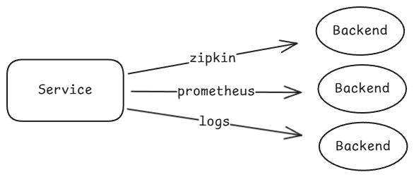
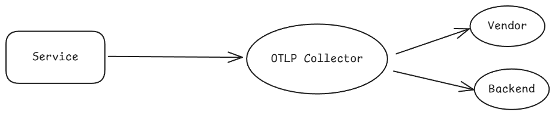
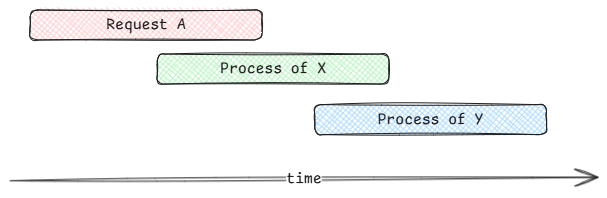
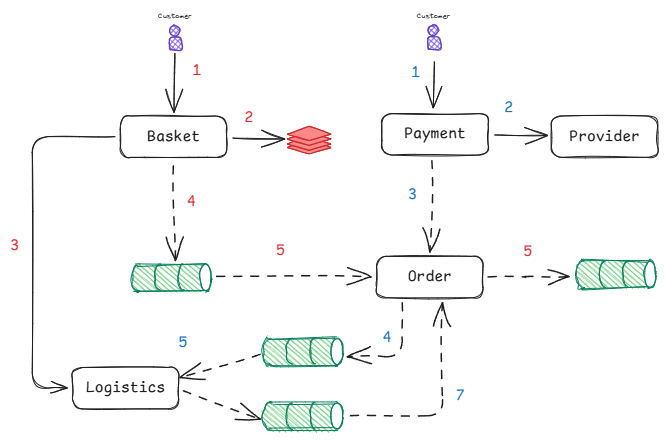

# Open Telemetry

### 🎯 Mission Statement

> Mission is to enable effective observability  
> by making high-quality, portable telemetry  
> ubiquitous and vendor-agnostic.

This reflects the core philosophy behind **OpenTelemetry** —  
to provide consistent, standardized, and interoperable telemetry data  
across metrics, traces, and logs — independent of the tools or vendors you use.

* API, SDKs
* Tooling
* Integrations

## Signals

OpenTelemetry defines **four core telemetry signal types**, each serving a unique purpose in achieving full observability.

---

### 📊 Metrics
- **Definition:** A measurement captured at runtime.  
- **Purpose:** Quantifies behavior or performance (e.g., request rate, CPU usage, latency).  
- **Examples:**  
  - `http.server.request.count`  
  - `orders_processed_total`  
  - `memory_usage_mb`

---

### 🪵 Logs
- **Definition:** A recording of an event.  
- **Purpose:** Captures discrete events or errors for diagnostic analysis.  
- **Examples:**  
  - `Order validation failed for ID=1234`  
  - `Payment gateway timeout`

---

### 🕸️ Traces
- **Definition:** The path of a request through your application.  
- **Purpose:** Shows how different components interact across service boundaries, forming a **distributed trace**.  
- **Examples:**  
  - HTTP request lifecycle (API Gateway → Order Service → Payment Service)  
  - Database query within a span

---

### 🎒 Baggage
- **Definition:** Contextual information that is passed between signals.  
- **Purpose:** Propagates metadata (e.g., tenant, user, country) across service and process boundaries for correlation.  
- **Examples:**  
  - `country=CZ`
  - `user_id=42`

---

Together, these signals provide **end-to-end visibility** into system behavior — enabling performance insights, error detection, and cross-service correlation.

## Collecting Signals from Applications

### 🏢 Vendor-Specific Backends
Send telemetry directly to a specific observability platform.


**Examples:**
- **Jaeger** — Distributed tracing  
- **Datadog** — Unified observability platform  
- **New Relic** — Application performance and monitoring  
- **Grafana Cloud / Loki / Tempo** — Metrics, logs, and traces stack  

### 🌐 Vendor-Neutral Pipeline
Send telemetry to an **OpenTelemetry Collector**, which acts as a **universal gateway**.



**OpenTelemetry Collector**
- Receives telemetry from multiple sources  
- Processes, enriches, or filters data  
- Exports to one or more backends (vendor-specific or open source)

Using the **OpenTelemetry Collector** is the recommended approach for **scalable, vendor-neutral observability**, giving you full control over data flow, cost, and governance.

### Distributed Tracing
# 🌐 Distributed Tracing

Distributed tracing provides **end-to-end visibility** into how requests flow across services in a distributed system.  
It enables you to understand dependencies, latency, and bottlenecks across microservices.

> In .NET, distributed tracing is built on the **`System.Diagnostics.Activity`** API.  

## 🧩 Core Concepts

### **Trace**
- A **collection of spans** representing a single request or workflow across services.  
- Identified by a unique `TraceId`.

### **Span**
- A **unit of work** within a trace (e.g., database call, API request, queue processing).  
- Each span has:
  - `TraceId` — identifies the trace it belongs to  
  - `ParentSpanId` — links to its parent span  
  - `Attributes`, `Events`, `Status` — provide context  
  - `Duration` — measures latency

    

### **Context Propagation**
- Ensures trace information flows across services and process boundaries.  
- Standards:
  - **W3C Trace Context** — carries `traceparent` and `tracestate` headers  
  - **W3C Baggage Context** — carries custom contextual metadata (e.g., tenant, user)




### .NET


## Metrics

OpenTelemetry in .NET provides several **metric instruments** to capture runtime measurements and correlate them with traces, resources, or contextual metadata.

 > In .NET, the Metrics API lives in **`System.Diagnostics.Metrics`**.  

## 📊 Metric Instruments

| Instrument | Description | Typical Use | Correlation Context |
|-------------|--------------|--------------|----------------------|
| **`Counter<T>`** | Monotonically increasing value | Request count, processed items | Correlate with trace/span via attributes like `service.name`, `http.route`, `trace_id` |
| **`UpDownCounter<T>`** | Value that can increase or decrease | Active connections, queue length | Usually correlated with gauge-like resources |
| **`ObservableCounter<T>`** | Callback-based, reports incremental counts periodically | CPU time, cache hits | Correlated with resource or service |
| **`ObservableUpDownCounter<T>`** | Callback-based, value can increase or decrease | Memory usage, thread count | Snapshot gauges, correlated with host or instance |
| **`Histogram<T>`** | Measures a distribution of values (durations, sizes) | Latency, payload size | Correlate with trace span duration or request ID |
| **`Gauge` (via Observable)** | Current value snapshot | Temperature, free memory | Correlate with host or resource attributes |

---

## ⚙️ Example: Defining Metrics in .NET

```csharp
using System.Diagnostics.Metrics;

var meter = new Meter("Eshop.Orders", "1.0.0");

// 1️⃣ Counter
var orderCounter = meter.CreateCounter<int>("orders_processed_total");

// 2️⃣ UpDownCounter
var activeOrders = meter.CreateUpDownCounter<int>("orders_active_count");

// 3️⃣ Histogram
var orderProcessingDuration = meter.CreateHistogram<double>("order_processing_duration_ms");

// 4️⃣ ObservableGauge
meter.CreateObservableGauge("system_memory_usage_mb", 
    () => new Measurement<double>(GetMemoryUsageMb()));
```

## Logs

**Logs** capture discrete events (info, warnings, errors) with context for troubleshooting.  
In .NET you typically write logs via **`Microsoft.Extensions.Logging`** (`ILogger<T>`), and OpenTelemetry can **export** them alongside traces/metrics for full correlation.

> In .NET, app logging uses **`Microsoft.Extensions.Logging`**.  


## ⚙️ Example: Configure Logs in .NET
```csharp
builder.Logging.AddOpenTelemetry(o =>
{
    o.IncludeScopes = true;          // include ILogger scopes
    o.ParseStateValues = true;       // capture structured state values
    o.IncludeFormattedMessage = true;
    o.SetResourceBuilder(resourceBuilder);
    o.AddOtlpExporter();             // or Console/Seq/etc.
});
```


## Correlating Logs with Traces

* **Automatic**: When you have Activity.Current (from ASP.NET Core/HttpClient instrumentation), OpenTelemetry includes trace_id and span_id in emitted logs.


### Resources
[Metrics](https://learn.microsoft.com/en-us/dotnet/core/diagnostics/metrics-instrumentation#get-a-meter-via-dependency-injection)  
[Distributed Tracing](https://learn.microsoft.com/en-us/dotnet/core/diagnostics/distributed-tracing)  
[Logs](https://opentelemetry.io/docs/languages/dotnet/logs/getting-started-aspnetcore/)  
[Open Telemetry .NET](https://opentelemetry.io/docs/languages/dotnet/)